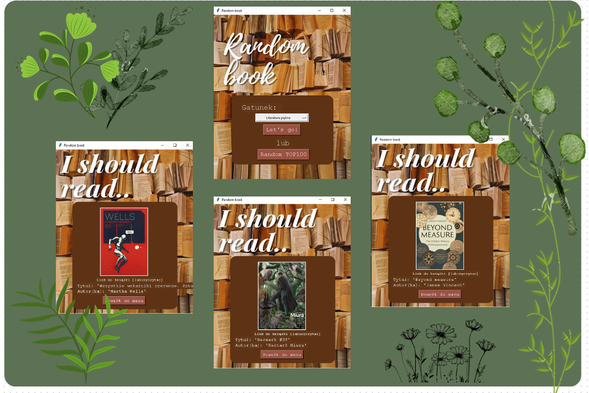

  <h1>RandomBookGen</h1>
  

# Projekt: aplikacja proponująca książki 

Oferuje użytkownikom mozliwość odkrywania nowych książek do przeczytania na podstawie ich preferencji. Umożliwia wybór konkretnego gatunku lub losowe wybranie jednej z najlepiej ocenianych książek z serwisu lubimyczytac.pl

# Opis projektu

<ol>
  <li><b>Brak oficjalnego API:</b> serwis nie udostępinia oficjalnego API, co oznaczało konieczność wykorzystania webscrapingu.</li>
  Projekt wymagał napisania dwóch scraperów, które pobierają informację o książkach. Następnie zintegrowałam je w aplikacji, aby dostarczyć użytkownikom spersonalizowane propozycje. 
  <li><b>Integracja scraperów z graficzną aplikacją Tkinter</b></li>
  Wprowadziłam odpowiednie struktury funkcji które wywołują scrapery, przetwarzają ich wyniki i prezentują użytkownikom wyniki w formie graficznej (okładka, link do książki, tytuł oraz autor). 
</ol>

# Funkcje
<ul>
  <li>Możliwośc wyboru gatunku książki</li>
  <li>Losowe wybranie jednej ksiązki z TOP100 ze strony lubimyczytac.pl</li>
</ul>

# Wymagania
<ul>
  <li>beautifulsoup4==4.11.1</li>
  <li>Pillow==10.0.0</li>
  <li>Requests==2.31.0</li>
</ul>

